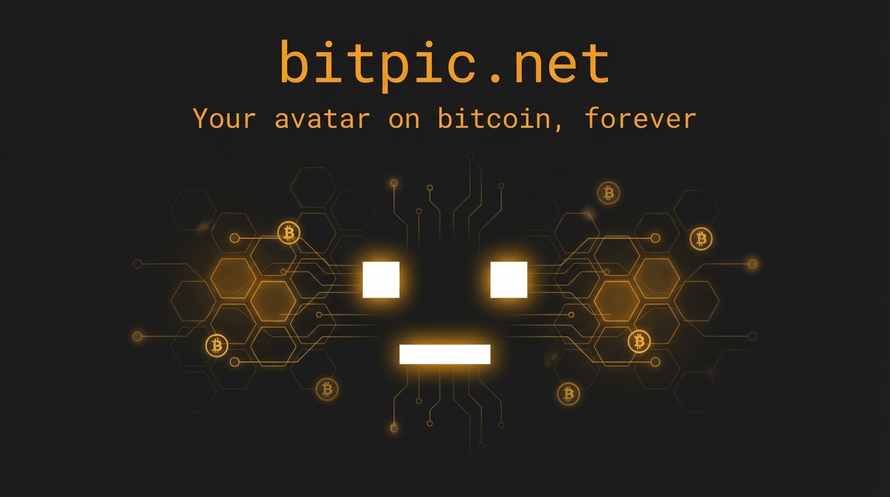

# bitpic.net



Gravatar for Bitcoin. Store your avatar on-chain, use it everywhere.

## What is BitPic?

BitPic is a protocol for hosting Paymail avatars on the Bitcoin blockchain. Instead of storing images on proprietary servers, BitPic stores them permanently on-chain, signed by your identity key.

- Uses [Paymail](https://bsvalias.org/) addresses instead of email
- Images stored 100% on Bitcoin, not a database
- Open protocol - anyone can run a BitPic node
- Mutable - upload a new avatar and it updates everywhere

## Usage

Once uploaded, reference your avatar from anywhere:

```html

```

### Image Sizing

Request specific sizes with the `size` parameter:

```
https://bitpic.net/u/yourname@example.com?size=128
```

Supported sizes: `32`, `64`, `128`, `256`, `512`

### Default Fallback

Specify a fallback image for paymails without an avatar:

```
https://bitpic.net/u/unknown@example.com?d=https://example.com/fallback.png
```

## Protocol

BitPic uses [B Protocol](https://b.bitdb.network/) for file storage with a BitPic-specific prefix:

```
OP_0
OP_RETURN
19HxigV4QyBv3tHpQVcUEQyq1pzZVdoAut    # B Protocol
  [Image Binary]
  image/jpeg
  binary
|
18pAqbYqhzErT6Zk3a5dwxHtB9icv8jH2p    # BitPic Protocol
  [Paymail]
  [Pubkey]
  [Signature]
```

| Prefix | Protocol |
|--------|----------|
| `19HxigV4QyBv3tHpQVcUEQyq1pzZVdoAut` | B (file storage) |
| `18pAqbYqhzErT6Zk3a5dwxHtB9icv8jH2p` | BitPic (avatar binding) |

## API

| Endpoint | Description |
|----------|-------------|
| `GET /u/<paymail>` | Avatar image (embeddable) |
| `GET /u/<paymail>?size=128` | Resized avatar |
| `GET /u/<paymail>?d=<url>` | Avatar with fallback |
| `GET /api/avatar/<paymail>` | Avatar metadata (JSON) |
| `GET /api/exists/<paymail>` | Check if avatar exists |
| `GET /api/feed` | Recent uploads |
| `POST /api/broadcast` | Broadcast transaction |

Full API documentation: [bitpic.net/docs](https://bitpic.net/docs)

## Paymail Registration

Register a `@bitpic.net` paymail at [bitpic.net/paymail](https://bitpic.net/paymail).

Includes:
- Avatar hosting
- Payment address resolution
- Ordinals receive address

## Development

```bash
# Install
bun install

# Run frontend
bun dev

# Run backend
cd backend && go run .

# Lint
bun run lint
```

## Tech Stack

- **Frontend**: Next.js 16, React 19, Tailwind CSS v4
- **Backend**: Go, Fiber, Redis
- **Blockchain**: JungleBus subscription, ARC broadcast

## License

MIT
